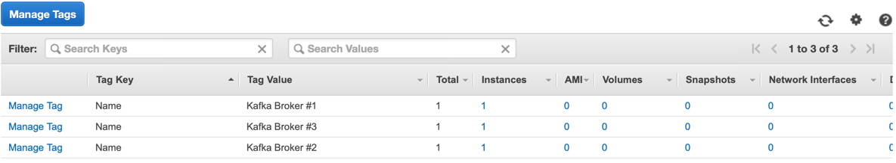
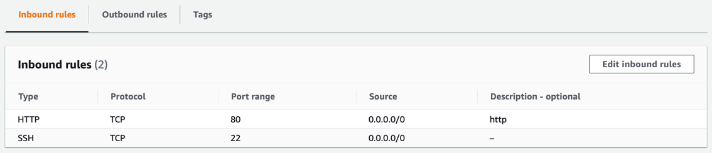

## EC2
> Elastic Compute Cloud

### 소개
- aws에서 가장 먼저 생겨난 서비스중 하나.
- 독립된 컴퓨터를 임대해주는 서비스

#### instance
- 컴퓨터 1대가 instance 하나.
- 

#### instance AMI (Amazon Machine Image)
- 인스턴스의 OS
- Amazon Linux, RHEL, SUSE Linux, Ubuntu, Window 선택 가능
#### instance type
- Type: 저장공간 사용량에 따라 비용 발생할 수 있음(무료사용은 free-tier인 t2.micro 사용.) 
- vCPUs, Memory, Instance Storage 등 선택 가능(선택에 따라 비용 발생할 수 있음.)

#### instance 장치 설정.
- EBS : Elastic Block Store
  + 대규모 처리량과 트랜잭션 집약적인 워크로드 모두를 지원하기 위해 Amazon EC2에서 사용하도록 설계된 고성능 블록 스토리지 서비스

### 태그와 보안그룹
#### 태그
- 생성된 인스턴스에 대한 설명을 태그로 생성할 수 있음.
  
#### 보안그룹 : Security Group
- 인스턴스에 대한 접근 권한 설정.
- 프로토콜(ssh/http/rdp), 접근 IP 등 설정 가능.
