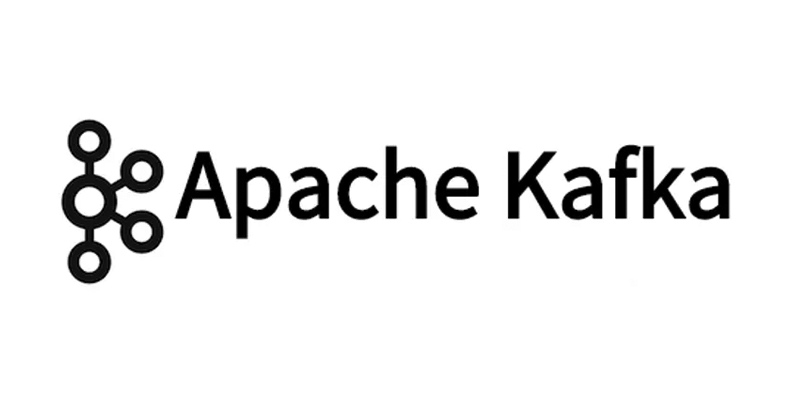
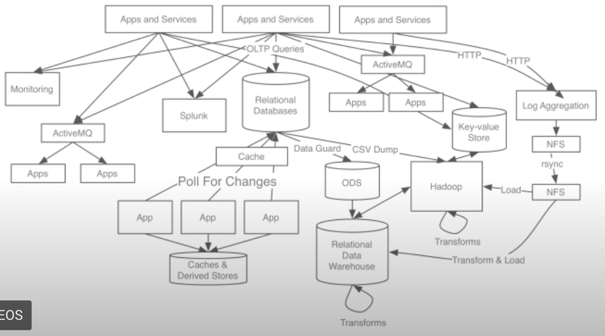

# Apache Kafka

> [무료]inflearn [데브원영]아파치 카프카 for beginners 강의 수강  
> [[inflearn 강의 link]](https://www.inflearn.com/course/%EC%95%84%ED%8C%8C%EC%B9%98-%EC%B9%B4%ED%94%84%EC%B9%B4-%EC%9E%85%EB%AC%B8)

### 아파치 카프카 개요 및 설명
#### before Kafka
  + source application , target application이 존재
  + source application과 target applicaiton이 많아지면서 문제 발생
  + 데이터 전송라인이 많아져 매우 복잡해짐.
  + 프로토콜 포멧의  파편화가 심해짐.
    
     
    
#### After Kafka
  + 복잡함을 제거하기 위해 LinkedIn에서 개발
  + src application과 target applicaion 의 커플링 약화
  + source application은 kafka에 데이터 요청
  + target application은 kafka에서 데이터 가져옴.
    
    
  + topic consumer로 구성.
  + 빅데이터 처리시 사용하지 않는 곳이 없음.
