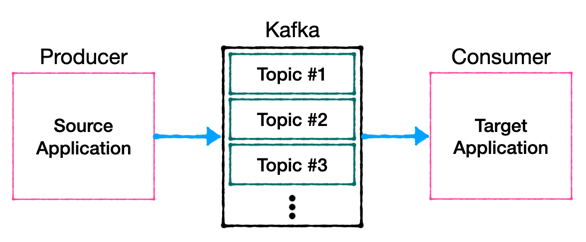

## what is Kafka TOPIC? 

### 개요

- 토픽은 여러개를 생성할 수 있음.
- 토픽은 DB의 테이블이나 파일시스템의 폴더와 유사한 성질을 가지고 있음.
- 이 토픽에 프로듀서가 데이터를 넣게 되고
- 컨슈머가 데이터를 가져감
- 토픽은 목적에 따라 클릭로그, send sms, location log 등과 같 무슨 데이터를 담는지 명확하게 명시하면 추후 유지보수 용이함. 

### 토픽 내부
- 하나의 토픽은 여러개의 파티션으로 구성될 수 있으며
- 첫번째 파티션 번호는 0부터 시작
- 하나의 파티션은 큐와 같이 내부의 데이터(record)가 끝에서부터 차기 시작.
- Consumer가 데이터를 가져갈 경우, 가장 오래된 순서로 가져가게 됨.
- Consumer가 record들을 가져가도 데이터는 삭제되지 않음.
- 새로운 consumer가 붙었을때 다시 0번부터 가져감
  + Consumer 그룹이 다르고 auto.offset.reset == earliest 이어야함.
  
