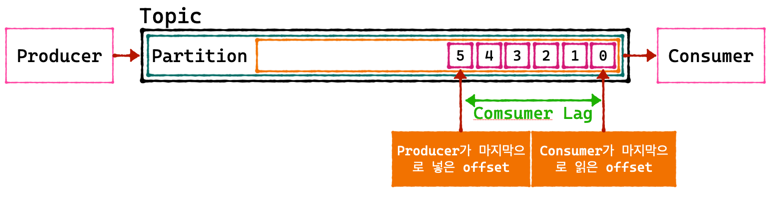
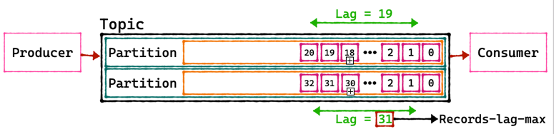

## Consumer Lag
> Kafka를 운영하는데 있어 중요한 모니터링 지표

Lag를 사용하려면 카프카 토픽과 파티 컨슈머와 프로듀션 오프셋에 모두 알아야함.  

  카프카 프로듀서는 토픽의 파티션에 데이터를 차곡차곡넣음.  
  이 파티션에 데이터가 하나하나씩 들어가게 되면 
  각 데이터는 오프셋이라고하는 숫자가 붙게됨.  

파티션이 1개인 토픽에 프로듀서가 데이터를 넣을 경우  

- 만약 Producer가 데이터를 넣어주는 속도가 Consumer가 가져가는 속도보다 빠를 경우,
- 이때의 간극을 Consumer Lag라고함.
- Lag은 각 파티션의 오프셋 기준으로 프로듀서가 넣은 데이터의 오프셋과  
- 컨슈머가 가져가는 데이터의 오프셋의 차이를 기반으로함.

토픽에 여러 파티션이 존재할 경우, lag는 여러개가 존재할 수 있음.

- 만약 컨슈머 그룹이 1개이고 파티션이 2개인 토픽에서 데이터를 가져간다면 lag는 2개가 측정될 수 있음.
- 이렇게 한개의 토픽과 컨슈머 그룹에 대한 lag이 여러개 존재할 수 있을때
  그 중 높은 숫자의 lag을 records-lag-max 라고 부름.