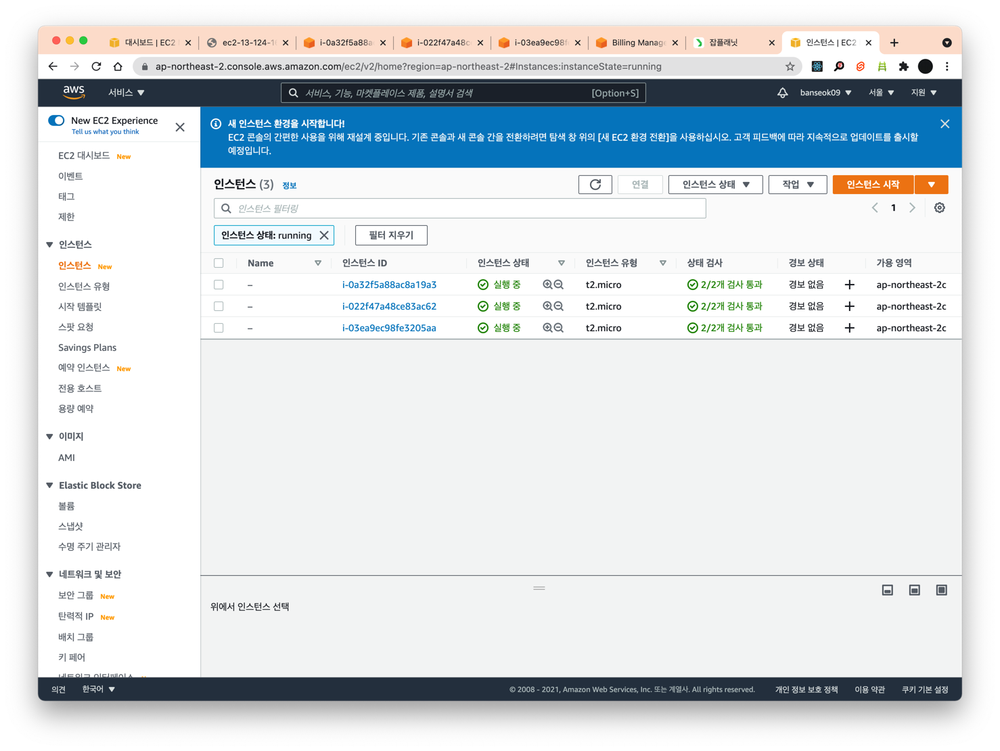
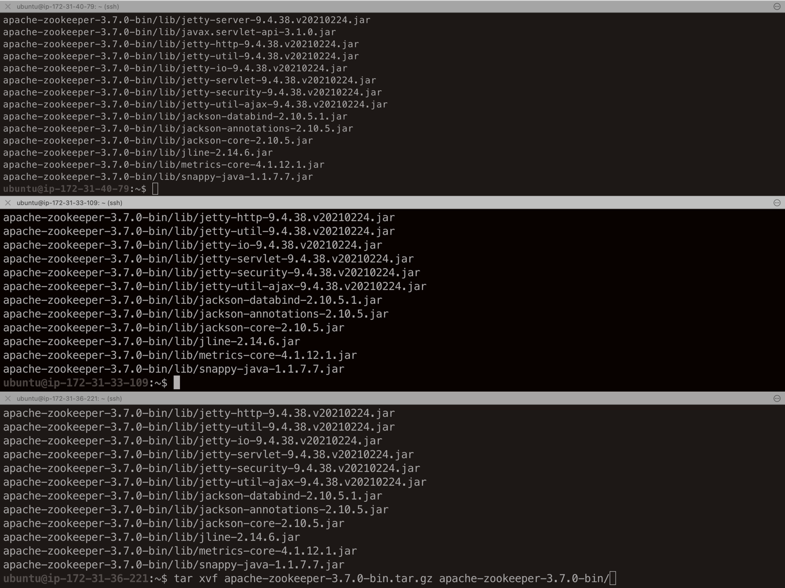

## AWS에 Kafka cluster 설치, 실행하기

### 카프카 및 주키퍼 설치
EC2 서버 3개 설치  
프리티어인 micro.m2 선택


iterm2로 instance 3대 모두 접속
```shell
ssh -i [pem 키 파일] ubuntu@[ec2인스턴스 url]
```


3대 모두 주키퍼 다운로드
```shell
wget https://downloads.apache.org/zookeeper/zookeeper-3.7.0/apache-zookeeper-3.7.0-bin.tar.gz
```


압축 해제
```shell
tar xvf apache-zookeeper-3.7.0-bin.tar.gz
```


주키퍼설정
```shell
cd apache-zookeeper-3.7.0-bin/conf
vi zoo.cfg
```

zoo.cfg
```vim
tickTime=2000
dataDir=/var/lib/zookeeper
clientPort=2181
initLimit=20
syncLimit=5
server.1=test-broker01:2888:3888
server.2=test-broker02:2888:3888
server.3=test-broker03:2888:3888
```


/etc/hosts에 설정 추가
