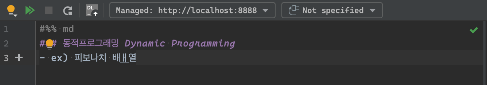
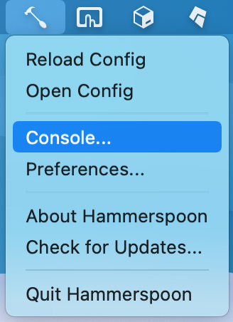
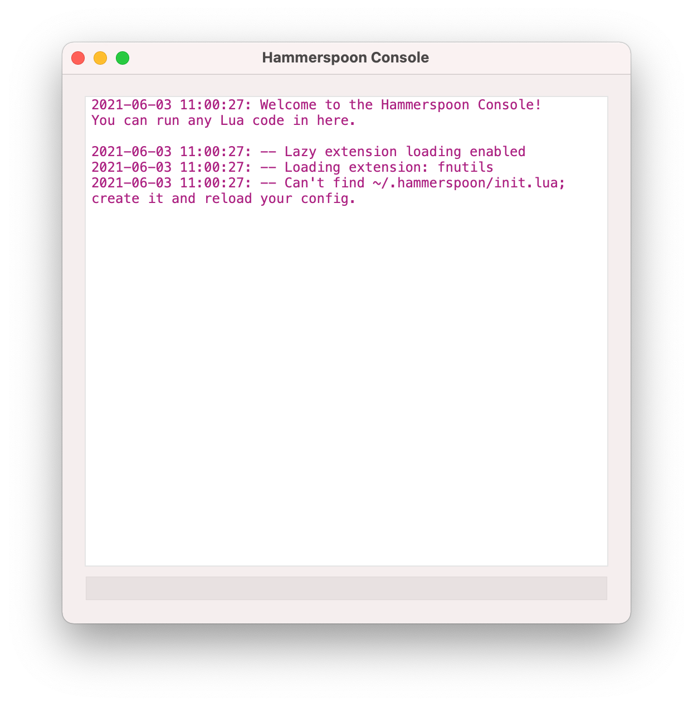
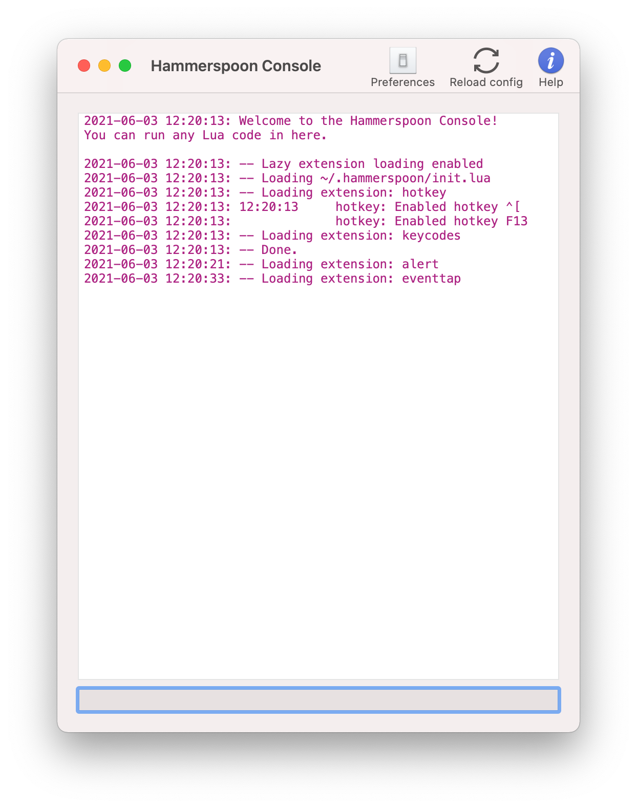

## 원할한 vim 사용을 위한 hammerspoon 설정
### 문제점
터미널, IntelliJ, Eclipse, VSCode,  
윈도우를 쓸경우 notepad++ 까지  
모두 vim plugin을 설치하여 사용중이다.
vim을 사용하는 것은 좋은데... 😭제일 큰 문제는 한글입력이다.



입력모드에서 한글을 입력하고 esc로 일반모드로 돌아온 다음  
일반모드의 명령어를 입력하면 저렇게 한글이 나와버린다.  

그래서 매번 한영(capslock)을 누르고 작업하는 것도 😡여간 불편한 일이다.

이에 대해 불편함을 느끼는 사용자는 나뿐만이 아니다.

> 참고 JohnGrib님 github link : <a href="https://github.com/johngrib/simple_vim_guide/blob/master/md/with_korean.md" 
> target="_blank">
> [한국어 키보드로 VIM 사용하기]</a>

방법 : 입력기 변경 (구름입력기가 좀 이상함: 한->영->한->영 되다가 갑자기 한->영->영(Uppercase) 현상 자주 발생. lag(지연)도 가끔 발생) 
방법 : noimd를 설정(해당 글에 써있듯 터미널vim에서 안됨.)  
방법 : input-source-switcher 설치(안해봄. 사실 해본거같기도 한데 기억안남.)  
방법 : Karabiner (시에라인지 하이시에라인지 이후 안됨.)  
방법 : AutoHotkey (🪟윈도우용임.)   
방법 : 최후의 수단 한글을 아예 사용하지 않고 영문으로만 컴퓨터를 사용하는 방법이 있습니다.(😭미국에서 태어날껄...)  

여기에 있는 마지막 방법을 제외한 방법들을 시도해봤으나 잘 되지않았다.

그렇게 capslock을 잘 누르며 쓰다가 불편해서 다시 검색해보다보니
hammerspoon을 알게 되었다.

윈도우의 autohotkey랑 비슷한 녀석인것같다.  
스크립트를 만들어 해당 키에 매핑을 해주면 된다.  

## 참고한 글

> 1. esc 입력시 영어 전환 : <a href="https://coldmater.tistory.com/177" target="_blank">[[VIM][OS X]한글 입력 상태에서 노멀모드 복귀 후 영어 입력소스로 전환하기 (feat. hammerspoon, autohotkey)]</a>
> 2. 한영전환시 현재 언어 표시 : <a href="https://velog.io/@riassuc/mac-hammerspoon" target="_blank">[hammerspoon을 이용한 한영전환 가독성]</a>


## 설정
### 0. hammerspoon 설치
먼저 hammerspoon부터 설치하자  
```shell
brew install hammerspoon
```
  
설치를 완료하니 Hammerspoon ~~이름 그대로 망치+숫가락~~ 아이콘이 생겼다.

### 1. esc 입력시 영어 전환

Console... 메뉴를 클릭.
  
init.lua파일을 찾을수 없다고 하니 init.lua파일을 만들자.

~/.hammerspoon/init.lua
```lua
-- esc, C-[ 입력시 영어 전환
require('modules.esc_auto_english')
```

~/.hammerspoon 디렉토리에 modules 폴더를 만든다.  
```shell
mkdir modules
```
init.lua에 설정한 대로
esc_auto_englist.lua 파일을 만든다.
```lua
local input_english = "com.apple.keylayout.ABC"

function input_eng_and_esc()
  local input_source = hs.keycodes.currentSourceID()
  if not (input_source == input_english) then
    hs.keycodes.currentSourceID(input_english)
  end
  hs.eventtap.keyStroke({}, 'escape')
end

hs.hotkey.bind({'control'}, 33, input_eng_and_esc)
hs.hotkey.bind({}, 'F13', input_eng_and_esc)
```

마지막 2줄을 보면
`Ctrl` + `[` 및 `F13` 입력시 현재 언어가 영어가 아니면 영어 전환 및 `esc`키를 입력하도록 되어있다.

본인의 키보드는 `~` 자리에 `esc`가 있는 이상한 키보드(anne pro2: ~~방향키도 없다~~)라서 `esc`를 누르는데 불편함이 없지만  
정상배열 키보드들은 `esc`를 누르기위해 왼손 새끼손가락이 너무 높게 올라가게 된다.  
그럴 경우 사용하는 일반모드 진입키가 `Ctrl` + `[` 이기 때문에 이 키도 같이 설정해주었다.  

마지막줄에 `esc`가 아니라 `F13`에 매핑한 이유는 `esc`에 매핑하면 정상동작을 하지 않기 때문이다. 이유는 잘 모르겠다.  
그래서 저 `F13`은 btt에서 `esc`입력시 `F13`이 입력되도록 설정했다.  
요약: `esc`입력 -> btt에서 `F13`으로 변환 -> hammerspoon에서 `F13`입력받아 한영전환 및 `esc`입력  
btt가 아니라 karabiner를 사용해도 될 것 같으나 해보지는 않겠다.  

👏이제 입력모드에서 한글을 쓰다가 `esc`입력시 자동 영어 전환 및 일반모드 진입이 된다.  

### 2. 한영전환시 현재 언어 표시
한영전환키를 눌렀을 때, 바뀐 언어가 뭔지 잘 모르겠을 때가 있다.  
상단 메뉴에 나오기는 하지만 너무 작고 눈에 잘 안띈다.  
그래서 한영 전환시마다 전환된 언어가 무엇인지 화면에 나오도록 설정을 하겠다.  

~/.hammerspoon/init.lua파일에 해당 내용을 추가하자.  
```lua
-- 한영 전환시 전환된 언어 표시
require('modules.input_source_alert')
```  
~/.hammerspoon/modules/에 input_source_alert.lua파일을 만든다.  
```lua
function input_source_alert()
    local input_source = {
      english = "com.apple.keylayout.ABC",
      korean = "com.apple.inputmethod.Korean.2SetKorean",
    }

    local current = hs.keycodes.currentSourceID()
    local language = nil

    if current == input_source.korean then
      language = '🇰🇷한글'
    elseif current == input_source.english then
      language = '🇺🇸English'
    else
      language = current
    end

    hs.alert.closeAll()
    hs.alert.show(language)

end

hs.keycodes.inputSourceChanged(input_source_alert)
```


이상이 없다면 위의 화면처럼 로그가 나올 것이다.


맥북에서 캡쳐시 alert창이 나오지 않아 폰으로 찍음.  


