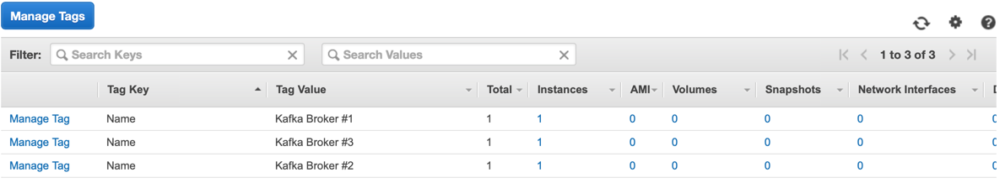
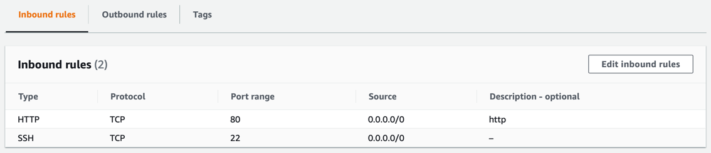

# EC2

## EC2란?
> Elastic Compute Cloud
- aws에서 가장 먼저 생겨난 서비스중 하나.
- 독립된 컴퓨터를 임대해주는 서비스

### instance
- 컴퓨터 1대가 instance 하나.

### instance AMI (Amazon Machine Image)
- 인스턴스의 OS
- Amazon Linux, RHEL, SUSE Linux, Ubuntu, Window 선택 가능
### instance type
  > 참고 : [[AWS 인스턴스 유형: AWS 홈페이지]](https://docs.aws.amazon.com/ko_kr/AWSEC2/latest/UserGuide/instance-types.html)
- vCPUs, Memory, Instance Storage 옵션 선택 가능(선택에 따라 비용 발생할 수 있음.)
- 범용: 컴퓨팅, 메모리 및 네트워킹 리소스의 균형을 유지하는 인스턴스  
  M, T로 시작(M4, M5, T2, T3, ...)  
- 컴퓨팅 최적화: 고성능 프로세서의 이점을 활용하는 컴퓨팅 집약적 애플리케이션에 적합함.  
  C로 시작(C4, C5, ...)  
- 스토리지 최적화: 초대형 데이터 세트에 대한 순차적 읽기 및 쓰기 액세스가 많이 필요한 작업에 적합하도록 설계 됨.
  대향 병렬 처리(MPP), MapReduce 및 Hadoop 분산 컴퓨팅, 로그 또는 데이터 처리 애플리케이션에 적합함.  
  D로 시작함(D2, D3, ...)  
- 메모리 최적화: 메모리에서 댇규모 데이터를 처리하는데 빠른 성능을 제공함.  
  관계형 DB 및 NoSQL, Key-Value 유형의 분산된 웹 캐시 저장소(Memcached, Redis) 등에 적합함.
  R로 시작함(R5, R5a, R5b, R5n ,,,)
- 액셀러레이티드 컴퓨팅 인스턴스 : 부동 소수점 계산, 그래픽 처리, 데이터 패턴 매칭등과 같은 기능을 효율적으로 수행함.  
  G, P로 시작(G3, G4ad, G4dn, P2, P3 ...) : 엔디비아 GPU 사용.  
  Inf1:  Amazon의 AI/ML 칩인 AWS Inferentia를 사용하여 기계 학습을 가속화하도록 설계됨.
  
  
- nano > micro > medium > large > xlarge > `n`xlarge(2xl, 3xl ...) 순서로 성능 증가
- 프리티어의 경우 T2(범용).mirco(저성능) 사용 가능  

### instance 장치 설정.
- EBS : Elastic Block Store
  + 대규모 처리량과 트랜잭션 집약적인 워크로드 모두를 지원하기 위해 Amazon EC2에서 사용하도록 설계된 고성능 블록 스토리지 서비스

## 태그와 보안그룹
### 태그
- 생성된 인스턴스에 대한 설명을 태그로 생성할 수 있음.
  
### 보안그룹 : Security Group
- 인스턴스에 대한 접근 권한 설정.
- 프로토콜(ssh/http/rdp), 접근 IP 등 설정 가능.

  
