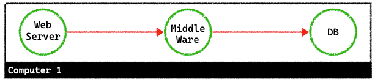
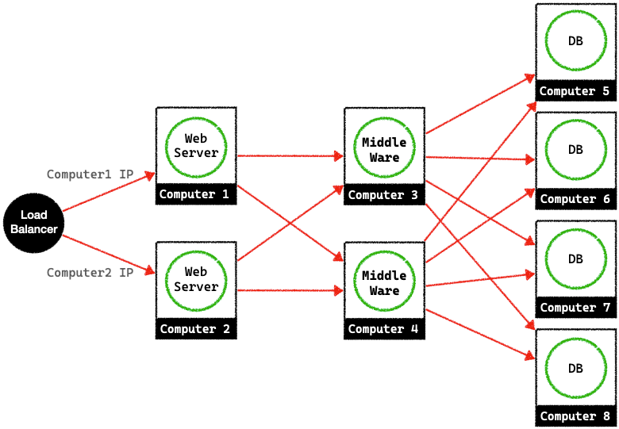

## EC2 scalability
- EC2(를 포함 클라우드서버)의 특징
    + 가상화
    + 종량제

### Scale Up
- 사용량에 따라 더 좋은 가상머신(AMI)로 교체

### Elastic IP
- EC2를 멈췄다가 다시 켜면 Public IP가 달라짐.
- Elastic IP를 생성하면 고정된 IP를 받음.
- 실행중인 인스터스와 연결된 한개 Elastic IP의 경우 무료

### Scale Out
- 시스템이 컴퓨팅을 더 많이 요구할 수록 scale up을 할경우, 단일 컴퓨터의 한계가 드러남.
- Scale Out은 여러대의 컴퓨터로 서비스 구성.

#### Scale Out의 흐름.                                                                 

### ELB
- Elastic Load Balancer
- aws에서 제공하는 Load Balancer
- health check: instance가 살아있는지 주기적으로 체크해 죽어있는 instance로는 사용자의 요청을 보내지 않음. 

### Auto Scaling
- CPU 점유율에 따라 instance 자동 생성 및 삭제