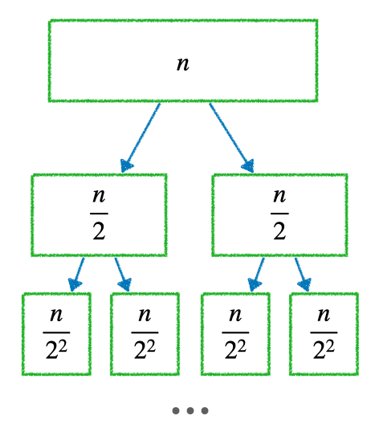

# [Sort] Merge Sort

## ⚙️ 정렬 방식

- 재귀(recursive) 용법을 활용한 정렬 알고리즘  
  1. 리스트를 절반으로 자르고 자른 리스트도 재귀적으로 계속 절반으로 자름  
  2. 자를 수 없으면(`len(arr)==1`) 다시 리스트를 합치면서 정렬하여 올라옴  
  3. 결국 정렬된 하나의 리스트 리턴  
    
  출처: [https://en.wikipedia.org/wiki/Selection_sort](https://en.wikipedia.org/wiki/Selection_sort)


## 📝 구현  

### 랜덤 배열 생성

  ```python
  import random as rd
  arr = rd.sample(range(1,101), 100)
  print(arr)
  ```  

### 랜던 배열 확인

  ```python
  [45, 40, 29, 65, 100, 75, 11, 92, 48, 54, 71, 47, 73, 58, 61, 33, 62, 90, 84, 43, 74, 4, 70, 82, 97, 23, 76, 57, 93, 17, 85, 8, 52, 96, 22, 56, 36, 35, 68, 86, 7, 2, 34, 99, 6, 53, 78, 10, 37, 87, 63, 15, 42, 1, 30, 94, 3, 41, 64, 80, 81, 83, 49, 95, 12, 72, 28, 5, 67, 50, 89, 27, 39, 18, 66, 20, 31, 59, 9, 55, 32, 44, 38, 13, 46, 24, 60, 25, 79, 21, 16, 14, 98, 77, 91, 19, 88, 26, 51, 69]
  ```

### 정렬 알고리즘 코드

  ```python
  def merge_sort(arr):
    if len(arr) <=1: return arr
    mid = len(arr)//2;
    left_arr = merge_sort(arr[:mid])
    right_arr = merge_sort(arr[mid:])
    return merge(left_arr, right_arr)

  def merge(left_arr, right_arr):
    merged_arr = list()

    # left_arr, right_arr 모두 값이 있을 때
    while len(left_arr) > 0 and len(right_arr) > 0:
      if left_arr[0] < right_arr[0] :
        merged_arr.append(left_arr.pop(0))
      else :
        merged_arr.append(right_arr.pop(0))

    # 위 while문이 종료되었다는 것은 left_arr right_arr
    # 둘 중 하나가 [] 이 된 것을 의미
    # left_arr에 데이터가 있을 경우는 right_arr에 데이터 없음
    # left_arr의 데이터 merged_arr로 append
    while len(left_arr) > 0 :
      merged_arr.append(left_arr.pop(0))
    # right_arr에 데이터가 있을 경우는 left_arr에 데이터 없음
    # right_arr의 데이터 merged_arr로 append
    while len(right_arr) > 0:
      merged_arr.append(right_arr.pop(0))
    return merged_arr
  ```

### 정렬 결과 확인

  ```python
  sorted_arr = merge_sort(arr)
  print(sorted_arr))
  ```

  ```python
  [1, 2, 3, 4, 5, 6, 7, 8, 9, 10, 11, 12, 13, 14, 15, 16, 17, 18, 19, 20, 21, 22, 23, 24, 25, 26, 27, 28, 29, 30, 31, 32, 33, 34, 35, 36, 37, 38, 39, 40, 41, 42, 43, 44, 45, 46, 47, 48, 49, 50, 51, 52, 53, 54, 55, 56, 57, 58, 59, 60, 61, 62, 63, 64, 65, 66, 67, 68, 69, 70, 71, 72, 73, 74, 75, 76, 77, 78, 79, 80, 81, 82, 83, 84, 85, 86, 87, 88, 89, 90, 91, 92, 93, 94, 95, 96, 97, 98, 99, 100]
  ```

<br>

## 🧮 알고리즘 분석  

  

- 각각 depth 에는 $ 2^i $의 노드가 있음  
- 각각 depth 안에 각각 노드의 리스트 길이는 $\frac {n} {2^i}$  
- 따라서 각 단계는 항상 **$2^i * \frac{n}{2^i} == O(n)$**  
- depth 는 총 $logn$ 이므로 시간복잡도는 $O(nlogn)$  

