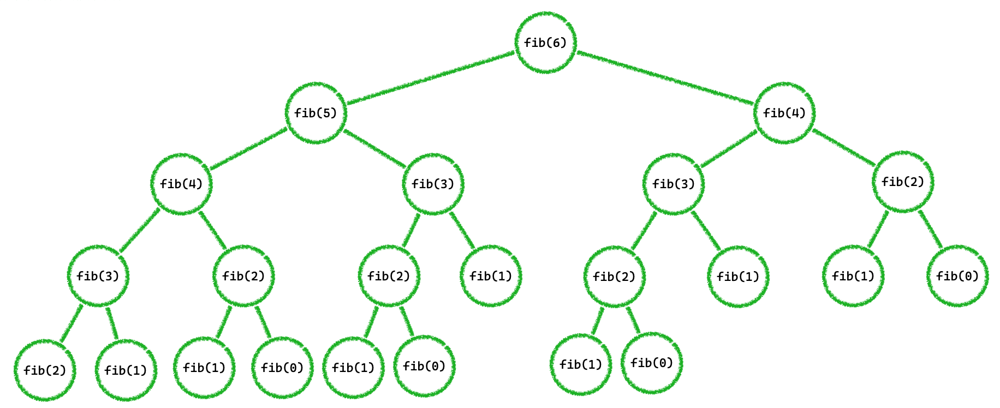

# [알고리즘] 피보나치 - 동적계획법  

## recursive 구현  

- 가장 단순하게 해결하는 방법은 재귀함수 구현이다.

```python
def fib(n):
    return (fib(n-1) + fib(n-2)) if (n > 1) else n
```

### ex) fib(6) 재귀함수 사용  



- 6번째 fibonacci 수를 구할때 총 23번의 호출이 이루어졌다.  
    + fib(5) : 1번 fib(4) : 2번 fib(3) : 3번  
    + fib(2) : 5번 fib(1) : 7번 fib(0) : 4번  

- 불필요하게 동일한 계산이 여러번 반복되는 것을 볼 수 있다.  

## 동적계획법 사용

- memoization을 사용, 계산한 값을 저장하여 중복 계산을 하지 않는다.  

```python
def fib_memo(n):
    memo = [0 for i in range(n+1)]
    memo[0] = 0
    memo[1] = 1
    for i in range(2, n+1):
        memo[i] = memo[i-2] + memo[i-1]
    return memo[n]
```
