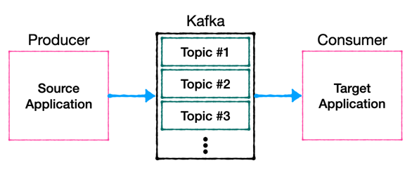
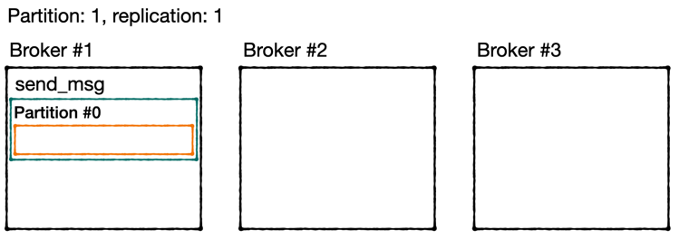
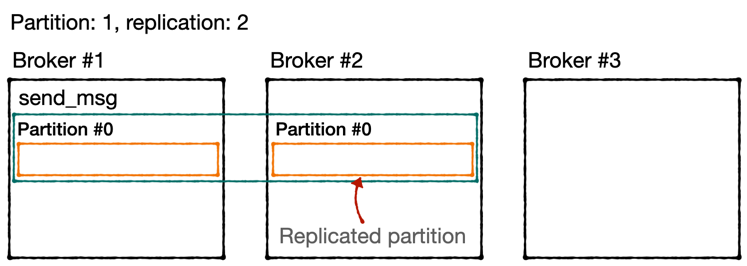
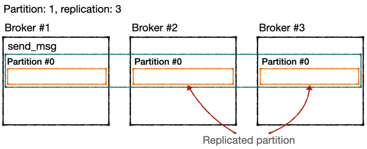
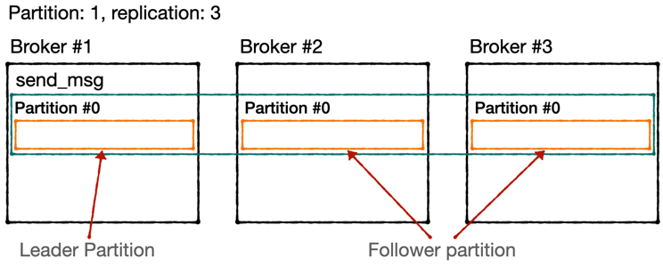

# Broker, Replication, ISR(In-Sync Replica)

## Broker
- 카프카가 설치되어 있는 서버 단위를 말함.
- 보통 3개 이상의 broker로 구성하여 사용하는 것을 권장.
- 파티션이 1개이고 replication이 1인 topic이 존재하고  
  브로커가 3대라면 3대중 1대에 해당 토피그이 정보(데이터)가 저장됨.
  
## Replication
- Kafka 아키텍쳐의 핵심.
- 클러스터에서 서버가 장애가 생길 때, 카프카의 가용성을 보장하는 가장 좋은 방법.
- replication은 partition의 복제를 뜻함.
- partiton의 고가용성을 위해 사용함.
- 만약 replication이 1이라면 partition은 1개만 존재함
  
- 만약 replication이 2라면 partition은 원본 1개와 복제본 1개로 구성됨.
  
- 만약 replication이 3이면 partition은 원본 1개와 복제본 2개로 구성.
  
- 다만, 브로커 캐수에 따라서 replication 개수가 제한됨.
  + 브로커 개수가 3이면 replicaton은 4 이상이 될 수 없음.
- 원본 1개의 파티션을 Leader Partiton이라고 부름.
- 나머지 2개의 파티션을 Follower Partition이라고 부름.
  
- 프로듀서가 토픽의 파티션에 데이터를 전달할 때, 전달 받는 주체는 Leader Partition.
- 프로듀서에는 ack라는 상세 옵션이 있는데, 이 ack를 통해 고가용성을 유지.
  + 이 옵션은 partition의 replication과 관련이 있음.
  + ack는 0, 1, all 옵션 3개 중, 1개를 골라서 설정할 수 있음.
  + 0: 프로듀서는 Leader Partition에 데이터를 전송하고 응답값을 받지 않음.  
  속도는 빠르지만 데이터 유실 가능성이 있음.
  + 1: Leader Partition에 데이터를 전송하고 정상적으로 받았는지 응답값을 받음.  
  나머지 파티션에 복제되었는지는 알수 없음.
  + all: 1옵션에 추가로 Follow Partitoin에도 복제가 잘 이루어졌는지 응답값을 받음.  
  all을 사용할 경우, 데이터 유실은 거의 없다고 보면 됨.  
  그렇지만 0,1에 비해 확인하는 부분이 많기 때문 속도가 현저히 느리다는 단점이 있음.
- Replication이 너무 많으면 브로커의 리소스 사용량도 늘어나게 됨.
- 따라서 kafka에 들어오느 데이터 량과 저장 시간을 생각해서 replication 개수를 정하는 것이 좋음. 

## ISR(In Sync Replica)
- Leader Partiton과 Follow Partition을 합쳐서 ISR 이라고 함.
