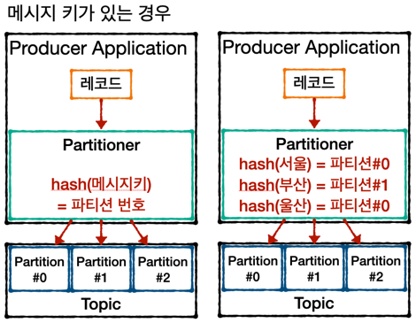

## Partitioner
Kafka Producer의 중요개념.  
Partitioner를 알면 partiton을 조금 더 효과적으로 사용할 수 있음.  
Producer가 데이터를 파티션에 보내면 무조건 Partitioner를 통해 브로커로 데이터가 전송됨.  

- Partitioner는 어떤 Partiton에 데이터를 넣을지 결정하는 역할을 함.
- Partitioner를 설정하지 않으면 UniformStickyPartitioner로 설정이 됨.
- 메시지 키가 있는 경우와 없는 경우에 동작하는 방식이 다름.
- 메시지 키가 있는 경우
  + 메시지 키를 가진 레코드는 파티션에 의해 특정한 해시 값이 생성됨
  + 이 해쉬값을 기준으로 어느 파티션에 들어갈지 결정됨.
  + 동일한 메시지 키를 가진 레코드는 동일한 해쉬값을 가지기 때문에  
    항상 동일한 파티션에 들어감.
    
- 메시지 키가 없는 경우
  + 라운드로빈으로 들어감.
  + 프로듀서에서 배치로 모을 수 있는 최대한의 레코드들을 모아서 파티션으로 보내게 됨.
  + 파티션에 적절히 분배됨.
- Kafka에서는 커스텀 파티셔너를 사용할 수 있도록 Partitioner인터페이스를 제공하고 있음.