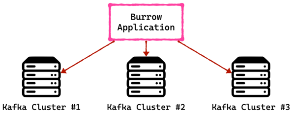

## Kafka Burrow
> Kafka Burrow: Consumer Lag Monitoring Application

lag를 실시간으로 모니터링하고싶다면  
데이터를 Elasticsearch(들어봤는데 모르는거)나 influxDB(안들어봤고 모르는거)와 같은 저장소에 넣은 뒤  
Grafana 대시보드(안들어봤고 모르느거)를 통해 확인할 수도 있음.

consumer 단위에서 lag을 모니터링 하는 것 아주 위험하고 운영요소가 많이 들어감.
- 컨수머 로직단에서 lag을 수집하는 것 컨수머 상태에 딛펜던시가 걸리기 때문.
- 추가적으로 컨수머가 개발될 때마다 해당 컨수머에 lag정보를 특정 저장소에 저장할 수 있도록 로직을 개발해야함.
- 만약 컨수머 lag을 수집할 수 없는 컨수머라면 lag을 수집할 수 없으므로 운영이 매우 까다로워짐.
- 그래서 linkedin에서는 apache kafka와 함께 카프카의 컨수머 lag을 효과저으로 모니터링 할 수 있도록 Borrow를 제공

### Burrow
> 오픈소스로서 Golang으로 작성되었고 현재 깃허브에 올라가 있음.  
> [[Burrow github repo]](https://github.com/linkedin/Burrow)

Burrow는 컨수머 lag 모니터링을 도와주는 독립적인 애플리케이션
특징
1. 멀티 카프카 클러스터 지원
  - kafka를 운영하는 대부분의 기업은 2개 이상의 kafka cluster를 운영하고 있음.
  - kafka cluster가 여러개이더라도 Burrow Application 1개만 실행해서 연동한다면 카프카 클러스터들에 붙은 컨슈머의 lag을 모두 모니터링 할 수 있음.
  
2. Sliding window를 통한 consumer의 status 확인.
  - Sliding window를 통해서 consumer의 status를 'ERROR', 'WARNING', 'OK'로 표현할 수 있도록 함.
  - 만약, 데이터 양이 일시적으로 많아지면서 consumer offer이 증가되고 있으면 'WARNING'으로 정의 됨.
  - 데이터의 양이 많아지고 있는데 consumer가 가져가지 않으면 'ERROR'로 정의하여 실제로 컨슈머가 문제가 있는지 여부를 알 수 있음
  - 이렇게 status를 기반으로 효과적으로 운영에 참고할 수 있음.
3. HTTP api 제공.
  - 이와 같은 정보들을 HTTP api를 통해 조회할 수 있음.
  - HTTP api를 이용하여 response 받은 데이터를 시계열DB와 같은 곳에 저장하는 application을 만들어서 활용할 수 도 있음.

