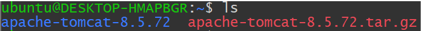
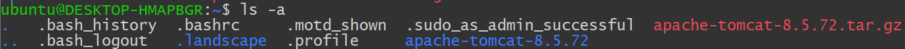

# [리눅스] 기본 명령어

## ⚙️ 환경
> Windows 11에 WSL Ubuntu 사용.

## 명령어 
### ls
- `ls`: list 명령어 (윈도우 터미널의 dir과 비슷)  
- 디렉토리 안에 파일 및 폴더 표시
- 사용방법 `ls -(옵션) (경로)`
- 경로의 경우, 입력하지 않는 다면 현재 경로이고 입력시에는 현재경로부터 상대경로로 입력
- ex) `ls ..` : 상위 디렉토리의 파일/폴더 출력, `ls conf`: 현재경로안에 conf 폴더의 파일/폴더 출력

#### 옵션
- -a : 숨김파일(.으로 시작하는 파일) 표시
  
- -l : 리스트 형식으로 출력
  
