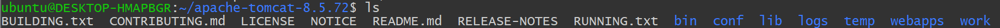
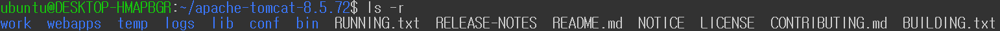
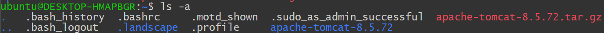

# [리눅스] ls 명령어

## ⚙️ 환경
> Windows 11에 WSL Ubuntu 사용.

## ls
- `ls`: list 명령어 (윈도우 터미널의 dir과 비슷)  
- 디렉토리 안에 파일 및 폴더 표시(알파벳 순서대로 출력)
- 사용방법 `ls -(옵션) (경로)`
- 경로의 경우, 입력하지 않는 다면 현재 경로이고 입력시에는 현재경로부터 상대경로로 입력

### 경로
- `ls` ,`ls .`  : 현재 경로 출력

- `ls ..` : 상위 경로 출력
  

- `ls conf` : 현재 디렉토리 안의 conf 폴더 출력
  

### 옵션
- `-r` : 역순으로 출력  
  

- `-a` : 숨김파일(.으로 시작하는 파일) 표시  
  

  
- `-l` : 리스트 형식으로 출력  
  

- `-t` : 시간 순서대로 출력  
  
 
- `-al` : 숨김파일 표시 + 리스트 형식으로 출력
  

- `-tl` : 시간순으로 리스트 출력(최신건이 위로 오도록)
  

- `-rtl` : 시간 역순으로 리스트 출력(최신건이 밑으로 오도록)

