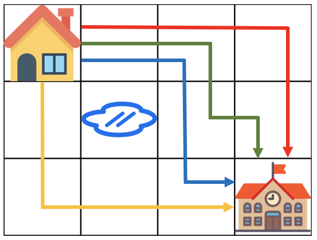

# [프로그래머스] Lv 3.등굣길 - 동적계획법  

> 문제 : [등굣길](https://programmers.co.kr/learn/courses/30/lessons/42898)

## 문제 설명  

계속되는 폭우로 일부 지역이 물에 잠겼습니다. 물에 잠기지 않은 지역을 통해 학교를 가려고 합니다. 집에서 학교까지 가는 길은 m x n 크기의 격자모양으로 나타낼 수 있습니다.

아래 그림은 m = 4, n = 3 인 경우입니다.


가장 왼쪽 위, 즉 집이 있는 곳의 좌표는 (1, 1)로 나타내고 가장 오른쪽 아래,  
즉 학교가 있는 곳의 좌표는 (m, n)으로 나타냅니다.  

격자의 크기 m, n과 물이 잠긴 지역의 좌표를 담은 2차원 배열 puddles이 매개변수로 주어집니다.  
오른쪽과 아래쪽으로만 움직여 집에서 학교까지 갈 수 있는 최단경로의 개수를 1,000,000,007로 나눈 나머지를 return 하도록 solution 함수를 작성해주세요.  

### 제한사항

- 격자의 크기 m, n은 1 이상 100 이하인 자연수입니다.  
  - m과 n이 모두 1인 경우는 입력으로 주어지지 않습니다.  
- 물에 잠긴 지역은 0개 이상 10개 이하입니다.  
- 집과 학교가 물에 잠긴 경우는 입력으로 주어지지 않습니다.  

### 입출력 예  
|m|n|puddles|return|
|---|---|---|---|
|4|3|[[2,2]]|4|

#### 입출력 예 설명


<br />

## 문제 풀이  
  

- 각각의 칸에서의 도착 가능한 경로의 개수는, 왼쪽 칸의 도착 가능한 경로의 수 + 위쪽 칸의 도착 가능한 경로의 수이다.
- 웅덩이가 있을 경우, 해당 칸의 도착 가능한 경로의 수는 0으로 계산한다.

## 코드 구현
  

- 웅덩이 칸의 경우, -1로 초기화한다.
- 더할때 편의를 위해 [0,x], [y,0]의 값들은 0으로 초기화한다.  
- [1,1]을 1로 초기화한다.
- [1:1] 부터 [m,n]까지 각각의 칸의 도착 가능한 경로의 수를 계산할 때 왼쪽칸과 위칸의 더한 값을 저장한다.
  - 웅덩이일 경우(-1), 0을 저장한다.      
- 마지막 칸 [m,n]의 도착 가능한 경로의 수를 반환한다.  

### Java

  ```Java
  class Solution {
      public int solution(int m, int n, int[][] puddles) {
          int[][] routeCntArr = new int[n+1][m+1]; // 해당 칸에 도착가능한 경로의 수 배열

          for(int[] puddle: puddles) {
              routeCntArr[puddle[1]][puddle[0]] = -1; // 웅덩이 -1로 초기화
          }

          for(int i=0; i<routeCntArr.length; i++) {
              for(int j=0; j<routeCntArr[i].length; j++) {
                  if(i == 0 || j == 0) {
                      // i:0,j:0은 실제 경로가 아닌 더하기를 위한 공간. 0으로 초기화.
                      routeCntArr[i][j] = 0;
                  } else if(i==1 && j==1){
                      routeCntArr[i][j] = 1; // 집(출발지) 1로 초기화
                  }else if(routeCntArr[i][j] == -1) {
                      routeCntArr[i][j] = 0;
                  } else {
                      routeCntArr[i][j] = (routeCntArr[i-1][j] + routeCntArr[i][j-1]) % 1000000007;
                  }
              }
          }
          return routeCntArr[n][m];
      }
  }
  ```
